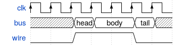

asciiwave: WaveDrom to ASCII art
================================

This utility reads WaveDrom JSON files like this:

```
{ signal: [
  { name: "clk",  wave: "P......" },
  { name: "bus",  wave: "x.==.=x", data: ["head", "body", "tail", "data"] },
  { name: "wire", wave: "0.1..0." }
]}
```

And produces ASCII art like this:

```
$ ./asciiwave example/step3.json
      ┏──┐  ┏──┐  ┏──┐  ┏──┐  ┏──┐  ┏──┐  ┏──┐  
clk : ┛  └──┛  └──┛  └──┛  └──┛  └──┛  └──┛  └──
      xxxxxxxxxxxx╱    ╲╱          ╲╱    ╲xxxxxx
bus : xxxxxxxxxxxx╲head╱╲   body   ╱╲tail╱xxxxxx
      ┐           ┌─────────────────┐           
wire: └───────────┘                 └───────────
```

WaveDrom would usually render a PNG or SVG like the below:



However, PNGs can not be pasted into comments in your HDL project!

asciiwave requires the `json5` library from PyPI, as a lot of WaveJSON samples floating around on the internet rely on non-vanilla-JSON features like unquoted keys, single-quoted strings and trailing commas. On a recent Ubuntu, this can be installed using

```
$ pip3 install json5
```
